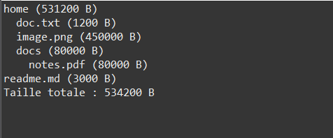

# Exercise 2: File System Modeling



## Objective
Learn to define and use abstract classes in Java by modeling a mini file system where each element (FsItem) can be either a file or a directory capable of calculating its size recursively.

## Description
This exercise creates a hierarchical file system representation using abstract classes and polymorphism. The system demonstrates the Composite design pattern, where directories can contain files and other directories, with recursive size calculation and tree visualization.

## UML Class Diagram

```
        +--------------------+
        |      FsItem        | «abstract»
        +--------------------+
        | - name : String    |
        +--------------------+
        | + getSize(): long  | «abstract»
        | + getName():String |
        | + toString():String|
        +---------▲----------+
                  |
    +-------------+--------------+
    |                            |
+-----------+              +---------------+
| FileItem  |              |  Directory    |
+-----------+              +---------------+
| - size    |              | - children[]  |
+-----------+              | - count : int |
| +getSize()|              | + add(item)   |
+-----------+              | + getSize()   |
                           | + list(indent)|
                           +---------------+

+-----------------+
|  FileSystem     |
+-----------------+
| - items[]       |
| - count : int   |
+-----------------+
| + addRoot(...)  |
| + listAll()     |
| + totalSize()   |
+-----------------+
```

## Class Structure

### FsItem (Abstract Base Class)
Located in `com.example.tp` package

**Attributes:**
- `name` (protected String): Item name

**Constructor:**
```java
public FsItem(String name)
```

**Abstract Method:**
```java
public abstract long getSize();
```
**Returns size in bytes - must be implemented by all subclasses!**

**Concrete Methods:**
```java
public String getName() {
    return name;
}

@Override
public String toString() {
    return name + " (" + getSize() + " B)";
}
```

### FileItem (File)

**Attributes:**
- Inherits `name` from FsItem
- `size` (private long): File size in bytes

**Constructor:**
```java
public FileItem(String name, long size)
```

**Implementation:**
```java
@Override
public long getSize() {
    return size;
}
```

**Example:**
```java
FileItem file = new FileItem("document.txt", 1200);
System.out.println(file.getSize());  // 1200
```

### Directory (Folder)

**Attributes:**
- Inherits `name` from FsItem
- `children` (private FsItem[]): Dynamic array of contained items
- `count` (private int): Number of items in directory

**Constructor:**
```java
public Directory(String name)
```
- Initializes array with capacity of 4

**Methods:**

#### add(FsItem item)
Adds file or subdirectory, expanding array if full.
```java
public void add(FsItem item) {
    if (count == children.length) {
        FsItem[] tmp = new FsItem[children.length * 2];
        System.arraycopy(children, 0, tmp, 0, children.length);
        children = tmp;
    }
    children[count++] = item;
}
```

#### getSize()
Recursively calculates total size of all contents.
```java
@Override
public long getSize() {
    long total = 0;
    for (int i = 0; i < count; i++) {
        total += children[i].getSize();  // Polymorphic call!
    }
    return total;
}
```

#### list(int indent)
Displays hierarchical tree structure.
```java
public void list(int indent) {
    System.out.println("  ".repeat(indent) + this);
    for (int i = 0; i < count; i++) {
        FsItem f = children[i];
        if (f instanceof Directory) {
            ((Directory)f).list(indent + 1);  // Recursive
        } else {
            System.out.println("  ".repeat(indent + 1) + f);
        }
    }
}
```

### FileSystem (Root Container)

**Attributes:**
- `items` (private FsItem[]): Dynamic array of root items
- `count` (private int): Number of root items

**Constructor:**
```java
public FileSystem()
```
- Initializes array with capacity of 4

**Methods:**

#### addRoot(FsItem item)
Adds root-level file or directory.
```java
public void addRoot(FsItem item) {
    if (count == items.length) {
        FsItem[] tmp = new FsItem[items.length * 2];
        System.arraycopy(items, 0, tmp, 0, items.length);
        items = tmp;
    }
    items[count++] = item;
}
```

#### listAll()
Displays entire file system tree.
```java
public void listAll() {
    for (int i = 0; i < count; i++) {
        FsItem f = items[i];
        if (f instanceof Directory) {
            ((Directory)f).list(0);
        } else {
            System.out.println(f);
        }
    }
}
```

#### totalSize()
Calculates total size of entire file system.
```java
public long totalSize() {
    long sum = 0;
    for (int i = 0; i < count; i++) {
        sum += items[i].getSize();
    }
    return sum;
}
```

## Example Usage

```java
public class Main {
    public static void main(String[] args) {
        FileSystem fs = new FileSystem();

        // Create files
        FileItem f1 = new FileItem("doc.txt", 1200);
        FileItem f2 = new FileItem("image.png", 450000);
        FileItem f3 = new FileItem("notes.pdf", 80000);

        // Create directories with nested structure
        Directory home = new Directory("home");
        home.add(f1);
        home.add(f2);

        Directory docs = new Directory("docs");
        docs.add(f3);

        // Nest docs inside home
        home.add(docs);

        // Add root items
        fs.addRoot(home);
        fs.addRoot(new FileItem("readme.md", 3000));

        // Display tree and total size
        fs.listAll();
        System.out.println("Taille totale : " + fs.totalSize() + " B");
    }
}
```

## Expected Output

```
home (531200 B)
  doc.txt (1200 B)
  image.png (450000 B)
  docs (80000 B)
    notes.pdf (80000 B)
readme.md (3000 B)
Taille totale : 534200 B
```

**Size Calculation:**
- doc.txt: 1200
- image.png: 450000
- notes.pdf: 80000
- **docs directory: 80000** (sum of contents)
- **home directory: 531200** (1200 + 450000 + 80000)
- readme.md: 3000
- **Total: 534200**

## Compilation & Execution

```bash
# From src/ directory
cd src
javac com/example/tp/*.java
java com.example.tp.Main
```

## Key Concepts Demonstrated

### 1. Abstract Classes
```java
public abstract class FsItem {
    public abstract long getSize();  // No implementation
}
```

**Cannot instantiate:**
```java
FsItem item = new FsItem("test");  // Compile error!
```

### 2. Composite Pattern
**Definition:** Treat individual objects and compositions uniformly.

**In this exercise:**
- **Leaf:** FileItem (no children)
- **Composite:** Directory (has children)
- **Component:** FsItem (abstract base)

```java
FsItem f = new FileItem(...);     // Leaf
FsItem d = new Directory(...);    // Composite

// Both treated uniformly
long size1 = f.getSize();
long size2 = d.getSize();  // Calls different implementations
```

### 3. Recursive Size Calculation
```java
public long getSize() {
    long total = 0;
    for (int i = 0; i < count; i++) {
        total += children[i].getSize();  // May call recursively!
    }
    return total;
}
```

**How it works:**
- For FileItem: Returns stored size
- For Directory: Sums all children (which may be directories themselves)

### 4. Tree Traversal
```java
public void list(int indent) {
    System.out.println("  ".repeat(indent) + this);
    for (FsItem child : children) {
        if (child instanceof Directory) {
            ((Directory)child).list(indent + 1);  // Recursive
        } else {
            System.out.println("  ".repeat(indent + 1) + child);
        }
    }
}
```

**Traversal type:** Depth-first, pre-order (print node then children)

### 5. Polymorphism
```java
FsItem[] items = new FsItem[10];
items[0] = new FileItem(...);
items[1] = new Directory(...);

// Uniform interface
for (FsItem item : items) {
    long size = item.getSize();  // Different implementations
}
```

### 6. Dynamic Array Management
- Both Directory and FileSystem use dynamic arrays
- Start with capacity 4
- Double when full
- No size limits

## Composite Pattern Explained

### Structure
```
Component (FsItem)
    ├─ Leaf (FileItem)
    └─ Composite (Directory)
           └─ Can contain more Components
```

### Benefits
1. **Uniform Interface:** Files and directories treated the same
2. **Recursive Operations:** Size calculation, tree printing
3. **Flexible Structure:** Nested directories of any depth
4. **Type Safety:** All items are FsItem

### Real-World Example
```
/home/                        (Directory)
  ├─ user/                    (Directory)
  │   ├─ documents/           (Directory)
  │   │   ├─ report.pdf       (File)
  │   │   └─ notes.txt        (File)
  │   └─ pictures/            (Directory)
  │       └─ photo.jpg        (File)
  └─ readme.txt               (File)
```

## Verification Checklist
- [ ] Cannot instantiate FsItem directly
- [ ] FileItem returns its size correctly
- [ ] Directory calculates recursive size
- [ ] Nested directories work (directories in directories)
- [ ] Tree display shows correct indentation
- [ ] Total size calculation is accurate
- [ ] Dynamic arrays expand when needed

## Possible Extensions

### 1. File Permissions
```java
public abstract class FsItem {
    protected boolean readable = true;
    protected boolean writable = true;

    public void setReadOnly() {
        writable = false;
    }

    public boolean canWrite() {
        return writable;
    }
}
```

### 2. File Search
```java
public class Directory extends FsItem {
    public FsItem find(String name) {
        for (int i = 0; i < count; i++) {
            if (children[i].getName().equals(name)) {
                return children[i];
            }
            if (children[i] instanceof Directory) {
                FsItem result = ((Directory)children[i]).find(name);
                if (result != null) return result;
            }
        }
        return null;
    }
}
```

### 3. File Type Detection
```java
public class FileItem extends FsItem {
    public String getExtension() {
        int dot = name.lastIndexOf('.');
        return dot > 0 ? name.substring(dot + 1) : "";
    }

    public String getType() {
        String ext = getExtension().toLowerCase();
        switch (ext) {
            case "txt": return "Text";
            case "jpg":
            case "png": return "Image";
            case "pdf": return "PDF";
            default: return "Unknown";
        }
    }
}
```

### 4. Statistics
```java
public class Directory extends FsItem {
    public int countFiles() {
        int count = 0;
        for (int i = 0; i < this.count; i++) {
            if (children[i] instanceof FileItem) {
                count++;
            } else {
                count += ((Directory)children[i]).countFiles();
            }
        }
        return count;
    }

    public int countDirectories() {
        int count = 0;
        for (int i = 0; i < this.count; i++) {
            if (children[i] instanceof Directory) {
                count++;
                count += ((Directory)children[i]).countDirectories();
            }
        }
        return count;
    }
}
```

### 5. Copy Operations
```java
public abstract class FsItem {
    public abstract FsItem copy();
}

public class FileItem extends FsItem {
    @Override
    public FsItem copy() {
        return new FileItem(name, size);
    }
}

public class Directory extends FsItem {
    @Override
    public FsItem copy() {
        Directory newDir = new Directory(name);
        for (int i = 0; i < count; i++) {
            newDir.add(children[i].copy());
        }
        return newDir;
    }
}
```

### 6. Filter by Size
```java
public class FileSystem {
    public FsItem[] findLargeFiles(long minSize) {
        List<FsItem> result = new ArrayList<>();
        for (int i = 0; i < count; i++) {
            findLargeFilesRecursive(items[i], minSize, result);
        }
        return result.toArray(new FsItem[0]);
    }

    private void findLargeFilesRecursive(FsItem item,
                                         long minSize,
                                         List<FsItem> result) {
        if (item instanceof FileItem && item.getSize() >= minSize) {
            result.add(item);
        } else if (item instanceof Directory) {
            Directory dir = (Directory) item;
            for (FsItem child : dir.children) {
                findLargeFilesRecursive(child, minSize, result);
            }
        }
    }
}
```

## Common Mistakes to Avoid

### 1. Forgetting Recursion
```java
// Wrong - only adds direct children
@Override
public long getSize() {
    return children.length;  // Wrong!
}

// Correct - recursively sums all
@Override
public long getSize() {
    long total = 0;
    for (int i = 0; i < count; i++) {
        total += children[i].getSize();  // Recursive!
    }
    return total;
}
```

### 2. Type Checking Before Polymorphism
```java
// Avoid if possible
if (item instanceof FileItem) {
    return ((FileItem)item).size;
} else {
    return ((Directory)item).calculateSize();
}

// Better - use polymorphism
return item.getSize();  // Let polymorphism handle it
```

### 3. Not Expanding Array
```java
// Bad - silently fails
public void add(FsItem item) {
    if (count < children.length) {
        children[count++] = item;
    }
}

// Good - expands when needed
public void add(FsItem item) {
    if (count == children.length) {
        expand();
    }
    children[count++] = item;
}
```

## Files
- `FsItem.java`: Abstract base class for file system items
- `FileItem.java`: Concrete file with size
- `Directory.java`: Composite directory with children
- `FileSystem.java`: Root container with tree operations
- `Main.java`: Test program with nested structure
- `subject.txt`: Complete exercise specifications

## Learning Outcomes
- Understanding abstract classes for common interfaces
- Implementing Composite design pattern
- Recursive algorithms (size calculation, tree traversal)
- Dynamic array management
- Type checking with instanceof
- Tree data structures in practice
